<p align="center">
  
</p>

<h1 align="center">Cross-Chain Agent Swarm</h1>
<p align="center"><em>Multi-agent coordination across chains.</em></p>

<p align="center">
  
  
  
  
</p>

<p align="center">
  <a href="docs/how-it-works.html"><strong>Interactive Demo</strong></a>&ensp;|&ensp;<a href="docs/architecture.html"><strong>Architecture</strong></a>
</p>

---

## The Idea

A **Planner** agent on Base decomposes complex tasks into subtasks, queries the **WorkerRegistry** to discover specialized agents by capability and chain, dispatches subtasks cross-chain to **Workers** on Arbitrum via **LayerZero V2**, collects result hashes, and releases ETH rewards on completion.

```
                                    LayerZero V2
  BASE (Planner)                    ┌──────────┐               ARBITRUM (Workers)
  ┌─────────────────┐  dispatch     │          │    recv        ┌──────────────────┐
  │  TaskManager    │──────────────▶│ LZ       │──────────────▶│  WorkerNode      │
  │  (OApp)         │               │ Endpoint │               │  (OApp)          │
  │                 │◀──────────────│          │◀──────────────│                  │
  │  createTask()   │  result       │          │    send        │  submitResult()  │
  │  releaseReward()│               └──────────┘               └──────────────────┘
  └────────┬────────┘                                          ┌──────────────────┐
           │ discover                                          │  WorkerRegistry  │
           └──────────────────────────────────────────────────▶│  register()      │
                                                               │  findWorkers()   │
                                                               └──────────────────┘
```

## Agent Capabilities

| Agent | Role | Chain | Capabilities |
|-------|------|-------|-------------|
| **Planner** | Task decomposition & dispatch | Base (EID 30184) | Task creation, worker selection, cross-chain dispatch, reward escrow |
| **Worker #1** | Data analyst | Arbitrum (EID 40231) | `data-analysis` — transaction counting, wallet profiling |
| **Worker #2** | Code reviewer | Arbitrum (EID 40231) | `code-review` — contract interaction analysis |

## Demo Output

```
╔══════════════════════════════════════════════════════════╗
║       CROSS-CHAIN AGENT SWARM                           ║
║       plan → discover → dispatch → receive → pay        ║
╚══════════════════════════════════════════════════════════╝

ℹ️  INFO    Deploying contracts...
ℹ️  INFO    TASK: 'Analyze wallet 0xABC across chains'

📐 PLAN     Decomposing task into subtasks:
📐 PLAN       → Subtask 1: 'Count Base transactions' (needs: data-analysis)
📐 PLAN       → Subtask 2: 'Review smart contract interactions' (needs: code-review)

🔍 DISCOVER Querying WorkerRegistry for capable agents...
🔍 DISCOVER Found 1 analyst(s), 1 reviewer(s)

🚀 DISPATCH Sending tasks to workers via LayerZero...
🚀 DISPATCH Task #0 delivered to Arbitrum WorkerNode
🚀 DISPATCH Task #1 delivered to Arbitrum WorkerNode

👷 WORKER   Worker submits: "42 transactions found on Base for 0xABC"
👷 WORKER   Worker submits: "3 contract interactions: Uniswap, Aave, Lido"

ℹ️  INFO    SWARM SUMMARY:
ℹ️  INFO      Tasks created: 2
ℹ️  INFO      Workers used: 2 (on Arbitrum)
ℹ️  INFO      Total reward locked: 0.01 ETH
ℹ️  INFO      Cross-chain messages: 4 (2 dispatches + 2 results)
ℹ️  INFO      Protocol: LayerZero V2 OApp
```

## Quick Start

```bash
# Install dependencies
npm install

# Compile contracts
npx hardhat compile

# Run tests (9 passing)
npx hardhat test

# Run agent demo
npx hardhat run agent/swarm-agent.ts
```

## Contracts

| Contract | Type | Description |
|----------|------|-------------|
| `TaskManager.sol` | OApp | Planner on Base. Creates tasks with ETH escrow, dispatches cross-chain, receives results, releases rewards. |
| `WorkerNode.sol` | OApp | Worker on Arbitrum. Receives tasks via LZ, submits result hashes back cross-chain. |
| `WorkerRegistry.sol` | Registry | On-chain directory. Workers self-register with capability + chain EID. Planner queries to discover workers. |

## Deployed Contracts

| Network | Contract | Address |
|---------|----------|---------|
| Base Sepolia | TaskManager | `TBD` |
| Arbitrum Sepolia | WorkerNode | `TBD` |
| Arbitrum Sepolia | WorkerRegistry | `TBD` |

## Hackathon

**PL_Genesis** — AI/AGI and Robotics track

This project demonstrates autonomous AI agents coordinating work across multiple blockchains using LayerZero V2 for trustless cross-chain messaging, with on-chain task management, worker discovery, and reward distribution.

---

<p align="center"><sub>Built with LayerZero V2 OApp, Hardhat, OpenZeppelin, and Claude Opus 4.6</sub></p>
